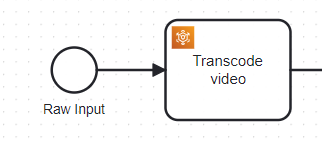
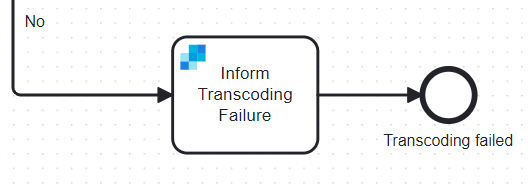

# Camunda AWS MediaConvert Blueprint

Welcome to Acheron's Camunda Blueprint for Media Workflow! This blueprint provides a robust solution for automating and optimizing complex media workflows by integrating Camunda with AWS Elemental MediaConvert service.

 With this integration, you can easily manage tasks like video transcoding, image overlaying, audio mixing, and more, all within a streamlined and scalable workflow. This guide will walk you through the features supported by the configured connector in the blueprint.

## Features

- **Transcode Videos** : Efficiently convert videos to different formats with support for advanced operations. You can transcode videos to the latest codecs like **AV1**, ensuring optimal compression and quality. Additionally, the blueprint allows you to adjust the video framerate to common standards such as **24fps**, **30fps**, or **60fps**, catering to various broadcasting and streaming requirements. You can also change video resolutions, making it easy to adapt content for different devices and screen sizes.

- **Overlay Image** : Enhance your videos with the capability to overlay images at precise pixel coordinates. This feature provides flexibility to adjust the overlay’s opacity, allowing for subtle or prominent imagery. You can also specify fade-in and fade-out durations for the overlay, creating smooth transitions that enhance the viewer's experience. Whether adding logos, watermarks, or promotional graphics, this functionality offers extensive customization to meet your needs.

- **Mix Audio and Video** : Seamlessly add an audio track to your video files, enhancing the multimedia experience. The blueprint supports mixing an **AAC audio track** with the video, making it ideal for adding background music, voiceovers, or sound effects. This feature is particularly useful for creating polished and professional content, whether for marketing, education, or entertainment purposes.

- **Combine Videos** : Merge multiple videos into a single, cohesive output with ease. This feature allows you to append one video directly to the end of another, enabling simple concatenation of clips. Whether you’re assembling highlight reels, creating comprehensive presentations, or compiling video series, this functionality streamlines the process and ensures a smooth playback experience.

- **Add Caption Track** : Improve accessibility and engagement by embedding subtitle tracks into your videos. The blueprint supports the inclusion of **SRT (SubRip Subtitle)** files, allowing you to provide synchronized captions that enhance the viewer's understanding and enjoyment. This is especially valuable for reaching a broader audience, including those with hearing impairments or who speak different languages.

These features combine to create a powerful toolkit for managing media workflows, making it easy to produce high-quality video content in a variety of formats and configurations.

## Blueprint

### Blueprint Walkthrough

To start using the blueprint, ensure that all required media files — such as video, audio, SRT subtitle files, or images are uploaded to your designated S3 bucket. These files must be accessible and properly formatted for the operations you intend to perform.

Once your media files are in place, you can initiate the workflow by providing the location of the video file you want to process. This location is fed into the workflow, which then configures the task using the AWS Elemental MediaConvert connector. You have the flexibility to choose the specific operation you want to perform on the video file, such as **Transcode Video**, **Overlay Image**, **Mix Audio and Video**, **Combine Videos**, or **Add Caption Track**.

In this example, we’ll choose the **Transcode Video** operation. When this operation is selected, a job is automatically created in the AWS Elemental MediaConvert service. This job processes the video based on the parameters and settings you’ve specified.

  

The next step in the workflow involves monitoring the status of the job in AWS Elemental MediaConvert. The system continuously polls for the job status at regular intervals—every 10 seconds in this case. If the job status shows **PROGRESSING**, the polling continues, waiting for the job to complete.

  

Once the job status changes to **SUCCESS**, the workflow advances to the next task, which involves generating a presigned URI. This URI provides secure, temporary access to the processed media file, allowing you to download or share the content as needed. The URL is by default set to expire in 10 minutes by the application.

  

However, if the job status returns **ERROR** or **CANCELED**, the workflow takes an alternative path. In this scenario, the system will notify the user that the transcoding job has failed. This notification is sent via email, using Camunda's SendGrid connector to ensure timely and reliable delivery. The email includes details about the failure, enabling users to quickly understand and address any issues that may have arisen during the processing.

  

## Contact Details

For any queries and further support, please drop us a mail at camunda.support@acheron-tech.com